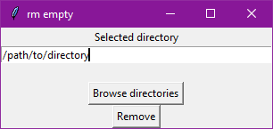

# rm_empty
 A small utlity tool to remove all useless empty directories at a given location.

 ## How to use
Make sure you have `tkinter` properly installed on you computer. Then you can run [rm_empty.py](./rm_empty.py) and a small UI will pop up.
Either use the browse directories button to chose the directory you want to clean up or the text entry to write the path to your directory. Then click on Remove to clean the directory. The program can immediatly be ran again on a new directory.

## To do
The following things might be added in the future to improve this small script:
- [ ] Check for invalid arguments
- [ ] Use `sys` library to be able to run `python3 ./rm_empty.py path_to_dir` instead of changing the source code
- [x] Add a simple UI to select the directory and run the script
- [ ] Add the possibility to use UI or terminal