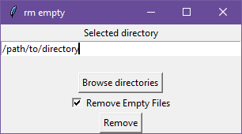

# rm_empty
 A small utility tool to remove all useless empty directories at a given location.

 ## How to use
Depending on the command line you run, you can use a GUI or not.
### Use GUI
Open the GUI simply by running the command `python rm_empty.py` in a terminal. It will open a window where you can either type the path to the directory you want to clean up or click on the Browse directories button to select the directory. 

To use the GUI, make sure you have the `tkinter` library properly installed.
### Use terminal
Run the command `python rm_empty.py --no-gui dir_to_path` (or simply `python rm_empty.py dir_to_path`) to clean the directory located at `dir_to_path`. 
You can also run `python rm_empty --no-gui` and the program will ask you to enter the path to the directory you want to clean.

## To do
The following things might be added in the future to improve this small script:
- [ ] Add option to remove empty files too
